# minFLUX

**(Unofficial) Minimal PyTorch implementation of FLUX diffusion transformers**

[](LICENSE)
[](#contributing)

A simplified educational PyTorch implementation of [FLUX.1](https://bfl.ai/models/flux-kontext) and [FLUX.2](https://bfl.ai/models/flux-2) diffusion transformers (DiT) by [Black Forest Labs](https://bfl.ai). Built for understanding rectified flow matching, joint attention, and the key design choices behind FLUX with verifiable line-by-line source mappings to the official codebases.

The diffusion models architectures and training algorithms are inferred from the official [diffusers](https://github.com/huggingface/diffusers/tree/cbf4d9a3c384ef97d6b0e40c9846dd9e0e41886a) repo. The VAE architectures are from the official BFL repos ([flux](https://github.com/black-forest-labs/flux/tree/802fb4713906133fcbd0d8dc5351620ca4773036) and [flux2](https://github.com/black-forest-labs/flux2/tree/50fe5162777813d869182b139e83b10743caef15)). Each `.py` file has an accompanying `.md` file with extensive mapping of every function to its exact source lines at pinned commits.

## What's Inside

- **FLUX.1 and FLUX.2 DiT architectures**- Double-stream and single-stream transformer blocks with joint attention
- **Rectified flow matching**- Training with velocity prediction and logit-normal timestep sampling
- **Euler ODE inference**- Sampling loop with configurable timestep schedules
- **VAE encoder/decoder**- Resnet and attention based architectures with latent normalization
- **Verifiable line-by-line source mappings**- To the official codebases

## Diffusion Equations

**Training** (rectified flow matching):

$$\begin{aligned}
x_t &= (1 - \sigma(t)) \cdot x_0 + \sigma(t) \cdot \epsilon && \text{(noisy input)} \\
v &= \epsilon - x_0 && \text{(velocity target)} \\
L &= \left\| model(x_t, t) - v \right\|^2 && \text{(MSE loss)}
\end{aligned}$$

**Inference** (Euler ODE step):

$$x_{t_{\text{next}}} = x_t + (\sigma(t_{\text{next}}) - \sigma(t)) \cdot model(x_t, t)$$

## FLUX.2 Architecture Overview



Detailed architecture: [FLUX.2 Model Architecture](flux2/model.md)

## Few differences between FLUX.1 and FLUX.2

| Component | FLUX.1 | FLUX.2 |
|---|--------|--------|
| Text encoder | CLIP + T5 | Mistral3 |
| `temb` (modulation signal) | Timestep + guidance + pooled CLIP text | Timestep + guidance only |
| VAE `z_channels` | 16 | 32 |
| VAE normalization | Scale/shift | Patchify (2×2) + BatchNorm |
| FFN | GELU | SwiGLU |
| Single-stream block | Separate attn + MLP | Fused QKV+MLP projection |
| Modulation | Per-block AdaLN | 3 shared heads (img, txt, single) |
| RoPE | theta=10000, axes=(16,56,56) | theta=2000, axes=(32,32,32,32) |
| Position IDs | 3D (ch, H, W) | 4D (T, H, W, L) |
| Biases | `bias=True` | `bias=False` |
| Blocks | 19 double + 38 single, 24 heads | 8 double + 48 single, 48 heads |

## Repository Structure

```
flux1/                     FLUX.1
  model.py                   DiT (double + single stream)
  training.py                flow matching + pack/unpack
  kontext_training.py        reference-image conditioning
  inference.py               Euler ODE sampling
  vae.py                     VAE (scale/shift)

flux2/                     FLUX.2
  model.py                   DiT (shared modulation, SwiGLU)
  training.py                flow matching + 4D position IDs
  inference.py               Euler ODE (empirical mu shift)
  vae.py                     VAE (patchify + BatchNorm)

utils/                     shared
  model.py                   embeddings, RoPE, attention, norms
  training.py                noise, loss, Euler step, train loop
  vae_utils.py               ResNet, attention, up/down blocks

tests/
  test_utils.py              unit tests
```

Each `.py` file in `flux1/`, `flux2/`, and `utils/` has an accompanying `.md` file with line-by-line mappings to the source-of-truth repos.

## Setup

```bash
pip install -r requirements.txt
python -m pytest tests/ -v
```

## Contributing

Contributions are greatly welcome, especially for:
- **Source-of-truth**: cross-reference code against [diffusers](https://github.com/huggingface/diffusers), [flux](https://github.com/black-forest-labs/flux), and [flux2](https://github.com/black-forest-labs/flux2) and fix any implementation discrepancies.
- **Documentation**: improve the accompanying `.md` files and update line mappings when diffusers changes.
- **Components**: add missing FLUX components or improve existing ones.

Feel free to [open an issue](https://github.com/purohit10saurabh/minFLUX/issues) or [create a pull request](https://github.com/purohit10saurabh/minFLUX/pulls).

## Disclaimer

Since minFLUX is inferred from the official diffusers and BFL repos, the possible sources of bugs in the code are:

- **AI-assisted**: This repo is vibe-coded. It is written with the help of AI, referencing the diffusers and BFL repos. Some training details are inferred from other works like dreambooth.
- **Simplifications**: Stripping ControlNet, IP-Adapter, gradient checkpointing, KV caching, FSDP/DeepSpeed support, and the attention processor dispatch pattern makes it incompatible with pretrained weights.
- **Upstream code changes**: Source-of-truth line numbers reference specific commits ([diffusers](https://github.com/huggingface/diffusers/tree/cbf4d9a3c384ef97d6b0e40c9846dd9e0e41886a), [flux](https://github.com/black-forest-labs/flux/tree/802fb4713906133fcbd0d8dc5351620ca4773036), [flux2](https://github.com/black-forest-labs/flux2/tree/50fe5162777813d869182b139e83b10743caef15)). These codebases change frequently, so functions may move, rename, or change signature.

## Citation

If you use this repository, please cite it as:

```bibtex
@misc{minflux2026,
  author = {Purohit, Saurabh},
  title  = {minFLUX: Minimal Pytorch Implementation of FLUX Diffusion Transformers},
  year   = {2026},
  publisher = {GitHub},
  url    = {https://github.com/purohit10saurabh/minFLUX}
}
```
