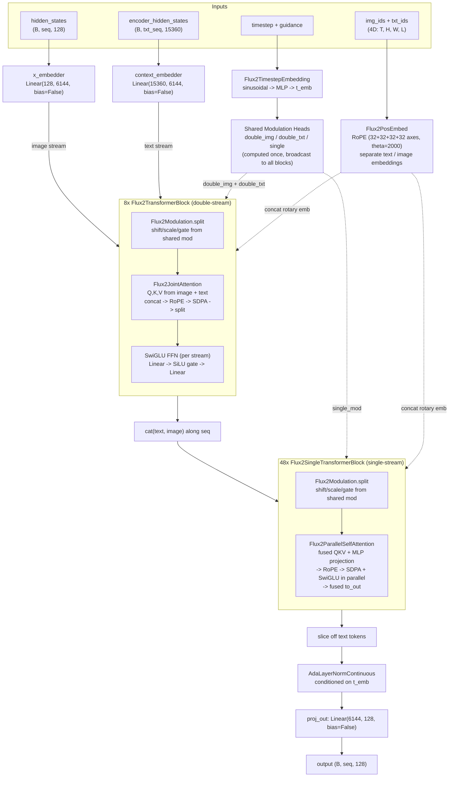

# Flux2 Model Documentation

The complete FLUX.2 transformer architecture in one file (~300 lines). Similar to `flux1/model.py` for FLUX.1.

## Architecture

### Key Design Choices

- **Double-stream blocks** ([`Flux2TransformerBlock`](model.py#L148)): Text and image maintain separate LayerNorm and SwiGLU FFN paths, but share a single joint attention. Both streams produce Q/K/V with separate projections; all three are concatenated across streams, Q and K are RMSNorm-ed and RoPE-encoded, then attend jointly via SDPA and split back by modality. Modulation (shift/scale/gate) comes from the model-level shared `Flux2Modulation` heads — not per-block learned AdaLN.
- **Single-stream blocks** ([`Flux2SingleTransformerBlock`](model.py#L179)): Text and image tokens are already concatenated. A single fused `to_qkv_mlp_proj` linear produces QKV and MLP input simultaneously. Q and K are RMSNorm-ed and RoPE-encoded. Attention and SwiGLU MLP run in parallel, then a fused `to_out` projects their concatenated outputs. One shared modulation set (shift/scale/gate) per block.
- **Shared modulation**: Three `Flux2Modulation` heads at model scope (`double_stream_modulation_img`, `double_stream_modulation_txt`, `single_stream_modulation`) compute modulation tensors once from `temb` and broadcast to all blocks of each type.
- **RoPE**: Rotary embeddings computed separately for image and text position IDs, then concatenated. 4 axes (32+32+32+32 = 128 = head_dim), theta=2000.

## Architecture Differences from FLUX.1

| Aspect             | FLUX.1                                                     | FLUX.2                                                                    |
| ------------------ | ---------------------------------------------------------- | ------------------------------------------------------------------------- |
| **Modulation**     | Per-block `AdaLayerNormZero` (6 params each)               | 3 shared `Flux2Modulation` heads at model level                           |
| **FFN**            | `Linear -> GELU(tanh) -> Linear`                           | `Linear -> SwiGLU -> Linear` (SiLU-gated)                                 |
| **Single-stream**  | Separate attn + MLP, `proj_out(cat(attn, mlp))`            | Fused `to_qkv_mlp_proj`, parallel attn+MLP, fused `to_out`                |
| **Timestep embed** | `FluxTimestepEmbedding` with pooled text projection        | `Flux2TimestepEmbedding` — timestep + guidance only                       |
| **RoPE theta**     | 10000                                                      | 2000                                                                      |
| **RoPE axes**      | `(16, 56, 56)` — 3 axes, single `pos_embed(cat(txt, img))` | `(32, 32, 32, 32)` — 4 axes, separate `pos_embed(img)` + `pos_embed(txt)` |
| **Biases**         | Most `bias=True`                                           | All `bias=False`                                                          |
| **Default config** | 19 double + 38 single blocks, 24 heads, 3072d                              | 8 double + 48 single blocks, 48 heads, 6144d                                              |
---

## Source of Truth

### Canonical Source Files

| Short Name          | Full Path                                                          |
| ------------------- | ------------------------------------------------------------------ |
| `transformer_flux2` | [`src/diffusers/models/transformers/transformer_flux2.py`](https://github.com/huggingface/diffusers/blob/cbf4d9a3c384ef97d6b0e40c9846dd9e0e41886a/src/diffusers/models/transformers/transformer_flux2.py) |
| `embeddings`        | [`src/diffusers/models/embeddings.py`](https://github.com/huggingface/diffusers/blob/cbf4d9a3c384ef97d6b0e40c9846dd9e0e41886a/src/diffusers/models/embeddings.py)                     |
| `normalization`     | [`src/diffusers/models/normalization.py`](https://github.com/huggingface/diffusers/blob/cbf4d9a3c384ef97d6b0e40c9846dd9e0e41886a/src/diffusers/models/normalization.py)                  |

### Line-by-Line Mapping

| minFLUX class                      | Canonical Source                                                                  | Source Lines     | Verdict                                         |
| ---------------------------------- | --------------------------------------------------------------------------------- | ---------------- | ----------------------------------------------- |
| `Flux2TimestepEmbedding`           | `transformer_flux2.Flux2TimestepGuidanceEmbeddings`                               | 982-1014         | EXACT MATCH                                     |
| `Flux2Modulation`                  | `transformer_flux2.Flux2Modulation`                                               | 1017-1037        | EXACT MATCH (incl. split)                       |
| `Flux2SwiGLU`                      | `transformer_flux2.Flux2SwiGLU`                                                   | 283-296          | EXACT MATCH                                     |
| `Flux2FeedForward`                 | `transformer_flux2.Flux2FeedForward`                                              | 299-322          | MATCH (`dim_out` now required, no `None` fallback)  |
| `Flux2JointAttention`              | `transformer_flux2.Flux2Attention`                                                | 493-548          | MATCH (stripped processor dispatch, no-op `Dropout(0.0)`) |
| `Flux2ParallelSelfAttention`       | `transformer_flux2.Flux2ParallelSelfAttention` + `Flux2ParallelSelfAttnProcessor` | 568-621, 708-783 | MATCH (inlined processor)                       |
| `Flux2TransformerBlock`            | `transformer_flux2.Flux2TransformerBlock`                                         | 855-947          | EXACT MATCH (logic)                             |
| `Flux2SingleTransformerBlock`      | `transformer_flux2.Flux2SingleTransformerBlock`                                   | 786-852          | MATCH (simplified, no split_hidden_states)      |
| `Flux2Transformer2DModel.__init`__ | `transformer_flux2.Flux2Transformer2DModel.__init_`_                              | 1094-1174        | MATCH (stripped KV cache, grad ckpt, `out_channels` attr) |
| `Flux2Transformer2DModel.forward`  | `transformer_flux2.Flux2Transformer2DModel.forward`                               | 1228-1381        | MATCH (stripped KV cache, grad ckpt)            |

### What Was Stripped

- **KV cache** (`kv_cache`, `kv_cache_mode`, `num_ref_tokens`, `ref_fixed_timestep`) — Klein KV variant
- **Gradient checkpointing** (`_gradient_checkpointing_func`)
- **Attention processor dispatch** (inlined directly as `F.scaled_dot_product_attention`)
- **ConfigMixin / ModelMixin / PeftAdapterMixin** (diffusers infrastructure)
- **fp16 overflow clipping** (`clip(-65504, 65504)`)
